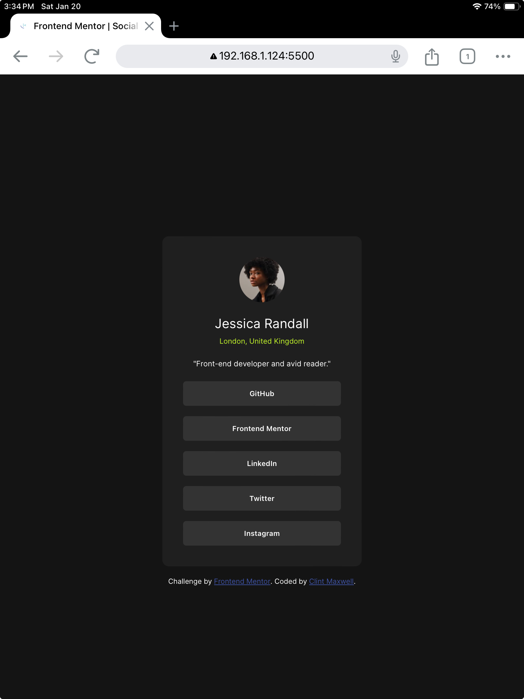
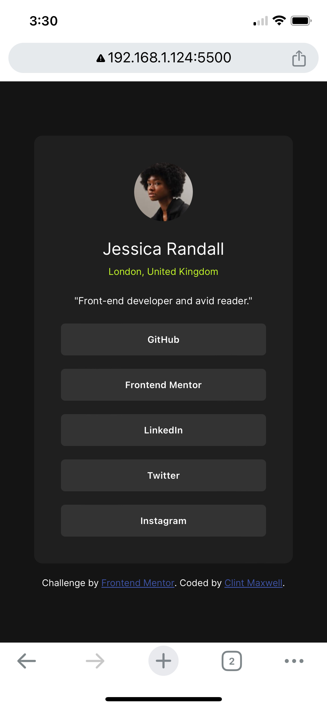

# Frontend Mentor - Social links profile solution

This is a solution to the [Social links profile challenge on Frontend Mentor](https://www.frontendmentor.io/challenges/social-links-profile-UG32l9m6dQ). Frontend Mentor challenges help you improve your coding skills by building realistic projects.

## Table of contents

- [Overview](#overview)
  - [The challenge](#the-challenge)
  - [Screenshot](#screenshot)
  - [Links](#links)
- [My process](#my-process)
  - [Built with](#built-with)
  - [What I learned](#what-i-learned)
  - [Continued development](#continued-development)
  - [Useful resources](#useful-resources)
- [Author](#author)
- [Acknowledgments](#acknowledgments)

**Note: Delete this note and update the table of contents based on what sections you keep.**

## Overview

### The challenge

Users should be able to:

- See hover and focus states for all interactive elements on the page

### Screenshot

#### Desktop Version

#### Tablet Version

#### Mobile Version

### Links

- Solution URL: [Add solution URL here](https://your-solution-url.com)
- Live Site URL: [Add live site URL here](https://your-live-site-url.com)

## My process

### Built with

- Semantic HTML5 markup
- CSS custom properties
- Flexbox
- Mobile-first workflow

### What I learned

In this project, as in the past, I struggled with making the web page responsive across different sizes.  I kept on fidgeting with various width percentages, min-widths, max-widths, etc. that eventually I chucked those out the window in favor of something simple that is adaptable on different devices (and without the use of media queries, too!).

### Continued development

On future projects, I will strive to follow the old adage "less is more" when it comes to responsive CSS design.

### Useful resources

- [How to "make a site responsive" and use Media Queries well](https://fedmentor.dev/posts/responsive-meaning/) - Many thanks to Grace Snow for posting this on her website.  A refreshing reminder to keep it simple :)
- [5 simple tips to making responsive layouts the easy way](https://youtu.be/VQraviuwbzU?si=yGUtnosOvF25b11i) - Here in this YouTube video it's Kevin Powell to the rescue, offering tips on responsiveness that are easy to implement.

## Author

- Frontend Mentor - [@AntonioHouTX](https://www.frontendmentor.io/profile/AntonioHouTX)

